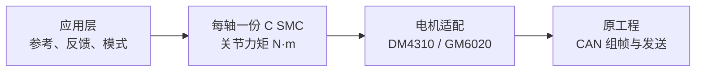

# RoboMaster SMC Controller

**面向 STM32 云台的纯 C99 滑模控制器库，提供 DM4310 与 GM6020 力矩适配。**

[](https://github.com/LYHrmer/robomaster-smc-controller/actions/workflows/c-tests.yml)
[](include/gimbal_smc.h)
[](LICENSE)

[快速开始](docs/QUICKSTART.md) · [STM32 接入](docs/STM32_PORT.md) · [Pitch 整定](docs/PITCH_TUNING.md) · [在线拟合](docs/ONLINE_IDENTIFICATION.md) · [全部文档](docs/README.md)

把同一坐标系下的**目标、角度和角速度**交给控制器，得到关节力矩 **N·m**，再由电机适配器转换为 CAN 命令。算法无 HAL、RTOS、堆内存或 C++ 依赖；原工程继续负责模式管理、INS 和 CAN 发送。

Yaw、Pitch 分别使用独立实例与参数。优先提供 [RoboMaster 官方 C 型开发板例程](https://github.com/RoboMaster/Development-Board-C-Examples)的接入方法，适合已有电控框架、希望替换或比较云台闭环的开发者。

需要获取模型参数时，可选用 **STM32 在线 RLS** 或电脑端离线辨识。两者输出惯量、摩擦与重力等物理参数候选，**不会自动改写 SMC 配置或控制增益**。只使用控制器时，无需接入辨识模块。

## 从这里开始

| 你想做什么 | 阅读入口 |
|---|---|
| 先在电脑上运行，再了解接口 | [快速开始](docs/QUICKSTART.md) |
| 接到官方 C 板 / 自己的 STM32 工程 | [移植步骤](docs/STM32_PORT.md) → [电机协议与模式](docs/MOTOR_PROTOCOL.md) |
| 调整 Pitch 重力补偿、上下行程和参考限制 | [Pitch 接入与整定](docs/PITCH_TUNING.md) |
| 在 STM32 上随新数据拟合物理参数 | [在线 RLS 与云台积分接口](docs/ONLINE_IDENTIFICATION.md)（可选 C99 模块） |
| 从日志辨识惯量、摩擦与重力参数 | [离线辨识与整定流程](docs/IDENTIFICATION.md)（可选电脑端工具） |
| 了解模块依赖、目录和构建选项 | [工程结构](docs/PROJECT_STRUCTURE.md) |
| 理解公式、参数含义与改进 | [控制器设计](docs/CONTROL_DESIGN.md) |
| 查看仿真依据、结果及当前局限 | [验证记录](docs/VALIDATION.md) |
| 了解大小 Yaw / 折叠双 Pitch 如何扩展 | [多轴扩展方向](docs/MULTI_AXIS.md)（规划阶段） |

## 先在电脑上运行

需要 C99 编译器、CMake 3.16+；安装 Python 3.9+ 可运行默认配置的全部 **13 个 CTest 入口**。

```sh
git clone https://github.com/LYHrmer/robomaster-smc-controller.git
cd robomaster-smc-controller
cmake -S . -B build -DCMAKE_BUILD_TYPE=Debug
cmake --build build --parallel
ctest --test-dir build --output-on-failure
```

运行后检查 CTest 是否全部通过。默认测试覆盖控制器、电机、接入示例、在线拟合、长时数值回归和多场景仿真；生成的数据保存在 `build/`。开启可选电脑端辨识检查后共 **15 个入口**，需要 NumPy，见 [构建选项](docs/PROJECT_STRUCTURE.md#构建选项)。

下一步按 [快速开始](docs/QUICKSTART.md) 选择接口、加入源文件和接入反馈。在线拟合本身是 C99 模块，不依赖 Python 或 NumPy。

## 控制链路与主要功能



| 模块 | 提供的能力 |
|---|---|
| 单轴滑模核心 | 默认线性滑模与可调边界层；可选正则化终端项 |
| 参考生成 | 位置目标生成角度、速度、加速度；已有解析三元参考可直接输入核心 |
| 输出与有效性 | 力矩限幅、可选变化率限制、速度低通；检查周期、反馈超时和非有限值 |
| Pitch 辅助 | 有符号重力模型；独立的控制角、重力角与机械相对角接入示例 |
| 在线参数拟合 | C99 RLS 与积分窗口；检查激励和数据质量，输出固定构形下的物理参数候选 |
| 离线参数辨识 | 固定构形的积分回归、独立数据验证、float32 候选参数导出 |
| 电机适配 | 按方向、传动与电机参数换算力矩，提供协议编解码及统一组帧接口 |

参考生成器限制速度和加速度，**不保证参考无过冲**；Pitch 示例的参考包络也不等于机械停车保证。调参方法与适用条件见 [控制器设计](docs/CONTROL_DESIGN.md) 和 [Pitch 整定](docs/PITCH_TUNING.md)。

在线云台辨识要求固定底座、固定构形和同步标定的力矩反馈。`ready` 仅表示本拍满足候选数据门槛；参数仍需独立验证，并由应用显式采纳，见 [在线拟合说明](docs/ONLINE_IDENTIFICATION.md)。

## 电机和轴怎么选

| 对象 | 接入方式 | 关键条件 |
|---|---|---|
| DM4310 | MIT 模式，`kp=kd=0`，发送力矩前馈 | 核对模式、ID、协议量程、传动和看门狗 |
| GM6020 | 已启用的原生电流模式 | 核对电机固件、力矩常数、电流限制和 CAN 分组 |
| 连续多圈 Yaw | 连续角反馈与目标，`wrap_angle=false` | 保留累计圈数；最短路径角差只用于明确需要该语义的场景 |
| 有限行程 Pitch | 独立参数、重力前馈及机械角约束 | 明确重力相位、零位和上下行程，分别检查加速与制动余量 |
| 三轴 / 折叠双 Pitch | 单轴核心可复用，协调层待实现 | 当前没有三轴目标分配、折叠状态机或三轴联动验证 |

**GM6020 原生电流组为 `0x1FE/0x2FE`，旧电压组为 `0x1FF/0x2FF`。** 不能把电流命令直接交给未修改的官方旧 `CAN_cmd_gimbal()`；旧电压模式目前仅提供原始报文编码。详见 [电机说明](docs/MOTOR_PROTOCOL.md)。

接入时统一使用 **rad、rad/s、rad/s²、关节 N·m**；角速度必须是所用控制角在同一坐标系下的导数。保留有限数值检查，编译时不要启用 `-ffast-math`。每个电机只由一个有效控制路径输出，同组 CAN 帧由一个发送者合并。

## 已验证到哪一步

| 验证层级 | 当前结果 | 查看依据 |
|---|---|---|
| 主机回归 | Debug、Release 各通过 15 项；ASan/UBSan 默认配置通过 13 项 | [验证记录](docs/VALIDATION.md) |
| 开源模型闭环 | 两份模型派生参数，576 个组合通过 | [模型来源与结果](docs/OPEN_MODEL_VALIDATION.md) |
| Pitch 专项 | 20 个验收场景通过；另保留 4 个错误坐标诊断 | [大行程、偏载与重力坐标](docs/PITCH_VALIDATION.md) |
| 辨识工具与接入 | 合成参数恢复、异常/不可辨识边界检查；8 个候选 C 闭环案例 | [辨识范围与复现](docs/IDENTIFICATION.md) |
| 在线拟合 | 4 个在线候选、4 个初始模型对照均通过合成闭环检查 | [在线范围](docs/ONLINE_IDENTIFICATION.md)与[执行记录](docs/VALIDATION.md) |
| RLS 长时数值回归 | 12 万次五维慢变观测，包含失能、弱激励冻结、恢复和协方差检查 | [独立测试](tests/test_rls_endurance.c) |
| STM32 工具链 | GNU Arm 13.2.1 下，Cortex-M4F hard-float 六个静态库交叉编译通过 | [构建与边界](docs/VALIDATION.md) |

这些结果属于软件与模型验证。**本公共库尚无实机精度、整车固件或 MCU 最坏执行时间验证。** 在线案例使用模型结构和摩擦速度尺度已知的合成数据；Pitch 的 4 个错误坐标诊断不计入验收。ASan/UBSan 本机运行时关闭了 LeakSanitizer，完整环境和复现命令见 [验证记录](docs/VALIDATION.md)。

下面是 Pitch 专项的分方向误差，完整条件、门槛和原始数据见 [报告](docs/PITCH_VALIDATION.md)。


## 源码入口

完整模块依赖和可选构建关系见 [工程结构](docs/PROJECT_STRUCTURE.md)。

| 文件 / 目录 | 内容 |
|---|---|
| [gimbal_smc.h](include/gimbal_smc.h) / [gimbal_smc.c](src/gimbal_smc.c) | 单轴控制器与参考生成器 |
| [gimbal_motor.h](include/gimbal_motor.h) / [gimbal_motor.c](src/gimbal_motor.c) | DM4310 / GM6020 物理量换算与协议 |
| [gimbal_pitch.h](include/gimbal_pitch.h) / [gimbal_pitch.c](src/gimbal_pitch.c) | 固定平面 Pitch 重力辅助函数 |
| [gimbal_rls.h](include/gimbal_rls.h) / [gimbal_rls.c](src/gimbal_rls.c) | 通用在线最小二乘、激励检查与候选状态 |
| [gimbal_identification.h](include/gimbal_identification.h) / [gimbal_identification.c](src/gimbal_identification.c) | 云台采样到积分回归窗口的转换 |
| [examples/](examples/) | 通用轴和 Pitch 接入示例 |
| [tools/identify_gimbal.py](tools/identify_gimbal.py) | 电脑端离线辨识与 C 参数候选导出 |
| [tests/](tests/) / [sim/](sim/) | 回归测试、实际调用 C 核心的仿真与数据 |
| [docs/](docs/README.md) | 入门、原理、移植、整定、验证及参考资料 |

## 来源、许可与反馈

参考复旦大学星云 EGA 的 [滑模开源项目](https://github.com/xinruilee04/smc_controller)与[教学文章](https://bbs.robomaster.com/article/1939327?source=1)，按原理独立实现 C 接口。设计与框架对照见 [控制器设计](docs/CONTROL_DESIGN.md)、[RM 框架接口对照](docs/RM_FRAMEWORK_INTEGRATION.md)和[参考与致谢](docs/REFERENCES.md)。

本仓库新编写的代码与说明采用 [MIT](LICENSE)；归档的第三方模型保留其 BSD-3-Clause / Apache-2.0 许可及原始声明。

反馈问题时，请附电机型号/固件/模式、MCU、控制周期、轴与单位约定、参数，以及带时间戳的目标/反馈角度、速度、输出力矩和故障标志。可在 [Issues](https://github.com/LYHrmer/robomaster-smc-controller/issues) 提交。
