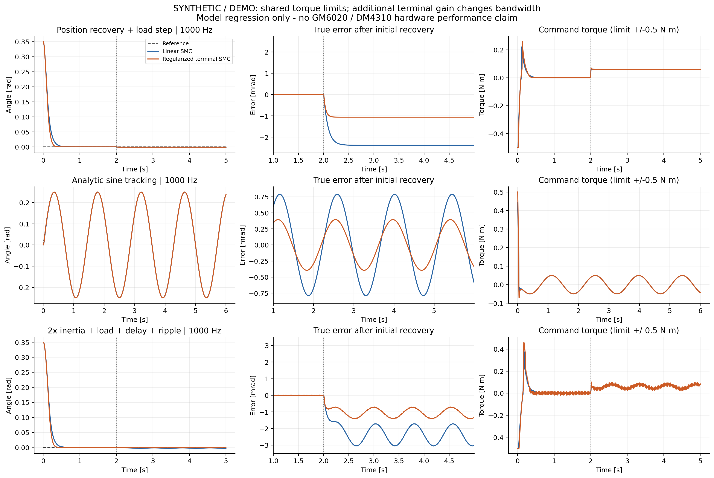

# RoboMaster SMC Controller

[](https://github.com/LYHrmer/robomaster-smc-controller/actions/workflows/c-tests.yml)

面向 RoboMaster 云台的 **纯 C99 滑模控制器库**，支持 DM4310 MIT 力矩模式与 GM6020 原生电流模式，优先提供 RoboMaster 官方 C 型开发板例程的接入方法。

核心无 HAL、RTOS、堆内存和 C++ 依赖。Yaw、Pitch 可独立实例化，分别整定；电机更换通过适配层完成。Pitch 提供独立的重力补偿与接入示例，区分控制姿态、重力相位和机械相对角，见 [Pitch 接入与整定](docs/PITCH_TUNING.md)。

**当前状态：主机 Debug／Release／ASan+UBSan 均通过 9 项测试，Cortex-M4F 四个静态库已交叉编译。** 验证包含两份开源模型的 576 个闭环组合，以及 [20 个 Pitch 验收场景和 4 个错误坐标诊断](docs/PITCH_VALIDATION.md)；尚无本公共库的硬件／MCU 时序测量。模型参数有来源和离线复算过程，电机、延迟、噪声与整定仍需匹配自己的云台。

单轴接口可以增加更多实例；多轴目标分配、姿态变换和轴间耦合补偿仍需在应用层实现。本轮没有进行三轴联动验证。

## 设计来源与改进

参考李欣睿、复旦大学星云 EGA 的 [云台滑模开源](https://github.com/xinruilee04/smc_controller) 与 [教学文章](https://bbs.robomaster.com/article/1939327?source=1)，按原理重新实现 C 接口，并针对周期、参考信号、数值和电机协议进行优化：

- 显式使用 rad、rad/s、rad/s²、关节 N·m，修正采样差分的量纲问题。
- 默认线性滑模加可调边界层；可选连续可微的正则化终端项。
- 小角误差仍保留速度制动和前馈；Pitch 提供有符号正弦/余弦重力模型、参考包络与硬越限故障锁存示例。
- 独立参考生成器限制目标速度、加速度，避免位置阶跃直接差分。
- 输出限幅、可选力矩变化率限制及速度低通；故障立即清零并复位动态状态。
- DM4310/GM6020 分别做物理量换算和 CAN 编码，统一组帧所有权。

完整推导、原实现问题及整定方法见 [控制器设计](docs/CONTROL_DESIGN.md)。本项目不宣称合成仿真证明了实机性能提升。

## 目录

```text
include/gimbal_smc.h                 单轴控制器与参考生成器 API
src/gimbal_smc.c                     纯 C 算法
include/gimbal_motor.h               电机配置、反馈和 CAN 帧接口
src/gimbal_motor.c                   DM4310 / GM6020 编解码
include/gimbal_pitch.h               固定平面 Pitch 重力模型 API
src/gimbal_pitch.c                   有符号保持力矩计算
examples/gimbal_controller_example.* 两轴可复用的模式与输出接入示例
examples/gimbal_pitch_example.*      Pitch 独立反馈、重力与参考约束接入
docs/CONTROL_DESIGN.md               模型、推导、优化与调参
docs/PITCH_TUNING.md                 Pitch 坐标、力矩预算、上下行程与调参
docs/PITCH_VALIDATION.md             大区间升降、偏载及重力坐标专项验证
docs/RM_FRAMEWORK_INTEGRATION.md      官方／社区框架的接口对照与移植边界
docs/MOTOR_PROTOCOL.md               官方协议依据和模式差异
docs/STM32_PORT.md                   官方 C 板例程移植步骤
tests/                              核心、电机、接入回归
sim/                                调用实际 C 核心的合成仿真与绘图
sim/open_models/                    两份开源模型原文、许可和派生参数
tools/derive_open_model_profiles.py  离线复算惯量、重力及核对来源哈希
cmake/arm-none-eabi.cmake             Cortex-M4F 交叉编译配置示例
```

## 最小调用

将 `src/gimbal_smc.c` 加入 Keil/IAR/CMake 工程，添加 `include` 路径并链接数学库。初始化一次，每个周期提供同一时间戳的反馈及参考：

```c
#include "gimbal_smc.h"

static gimbal_smc_t yaw;

bool yaw_init(void)
{
    gimbal_smc_config_t c;
    gimbal_smc_default_config(&c);
    /* Replace illustrative J/gains/limits with this gimbal's measured values. */
    c.wrap_angle = true; /* Only for shortest-path yaw, not multi-turn targets. */
    return gimbal_smc_init(&yaw, &c);
}

gimbal_smc_output_t yaw_step(float angle, float rate,
                             gimbal_smc_reference_t ref,
                             float dt_s, float oldest_feedback_age_s,
                             bool enabled)
{
    gimbal_smc_input_t in = {0};
    gimbal_smc_output_t out;
    in.angle_rad = angle;
    in.rate_rad_s = rate;
    in.reference_rad = ref.angle_rad;
    in.reference_rate_rad_s = ref.rate_rad_s;
    in.reference_accel_rad_s2 = ref.accel_rad_s2;
    in.dt_s = dt_s;
    in.feedback_age_s = oldest_feedback_age_s;
    in.enable = enabled;
    gimbal_smc_update(&yaw, &in, &out);
    return out; /* Inspect valid/flags, then map torque_nm to the motor. */
}
```

只有目标角度时，使用 `gimbal_reference_step()` 生成三元参考；完整调用与故障恢复见 [接入示例](examples/gimbal_controller_example.c)。初次启用时参考锚定到本拍反馈。是否使能、目标丢失后的行为、机械限位和故障恢复授权由现有云台模式管理器负责。

**返回有效力矩不表示已经完成发送。** CAN 发送者需检查适配返回值与 HAL 状态。DM 示例区分 DISABLED/ARMING/RUNNING/FAULT：ARMING 期间由上层发送 FC 并等待新鲜使能反馈，不用 FD 覆盖正在使能的命令；运行故障生成 FD。GM 停止时只清本轴槽，再由组帧所有者统一发送。

## 电机适配

| 电机 | 本库推荐接法 | 接入前要核对 |
|---|---|---|
| DM4310 | MIT，`kp=kd=0`，发送力矩前馈 | 模式、CAN/MASTER ID、PMAX/VMAX/TMAX、输出轴口径、看门狗 |
| GM6020 | 固件支持且已开启原生电流模式 | 模式、`Kt`、电流限制、ID及统一发送者 |

GM6020 电流组使用 **0x1FE/0x2FE**，旧电压组使用 **0x1FF/0x2FF**。不要把新版电流值交给未修改的官方旧 `CAN_cmd_gimbal()`。旧电压模式仅提供原始报文编码，尚未提供额外 MCU 电流内环。协议、固件要求与制造商资料见 [电机说明](docs/MOTOR_PROTOCOL.md)。

## 优先接入官方例程

以 [RoboMaster 官方开发板 C 例程](https://github.com/RoboMaster/Development-Board-C-Examples) 为主要参考：保留其模式管理、INS 与反馈转换，替换相应闭环的计算部分，并改造 CAN 输出接口。

官方 `gimbal_feedback_update()` 已进行陀螺轴转换，应复用更新后的角度/角速度。方向取反只做一次；GM 电流组由一个发送者统一提交。具体修改位置和 HAL 桥接代码见 [STM32 移植说明](docs/STM32_PORT.md)。本库不打包或改写官方整车工程。

另对照了 HNUYueLuRM 与 rm-controls 的目标、反馈、前馈和电机输出分层，见 [框架接口对照](docs/RM_FRAMEWORK_INTEGRATION.md)。借鉴的是接口职责与坐标处理；不同工程的陀螺轴、原生输出模式及单位仍须沿具体源码核对。

## 构建与测试

```sh
cmake -S . -B build -DCMAKE_BUILD_TYPE=Debug
cmake --build build --parallel
ctest --test-dir build --output-on-failure
./build/simulate build/simulation.csv
```

可选主机检测：`-DGIMBAL_SANITIZE=ON` 启用 AddressSanitizer/UBSan。若受调试器/ptrace 限制导致 LeakSanitizer 无法运行，可对测试进程设置 `ASAN_OPTIONS=detect_leaks=0`；算法本身不分配动态内存。

只构建 MCU 静态库：

```sh
cmake -S . -B build-arm \
  -DCMAKE_TOOLCHAIN_FILE=cmake/arm-none-eabi.cmake \
  -DGIMBAL_BUILD_TESTS=OFF -DGIMBAL_BUILD_SIM=OFF
cmake --build build-arm --parallel
```

需要自行安装 `arm-none-eabi-gcc`。示例配置为 Cortex-M4F hard-float，必须与目标 MCU、工程浮点 ABI 一致；H7/M7 等应调整编译参数。**不要启用 `-ffast-math`**，它可能破坏 `isfinite` 异常检查。终端项使用 `powf`，应在实际 MCU/中断负载下测量最坏执行时间。

开源模型验证见 [576 组合报告](docs/OPEN_MODEL_VALIDATION.md)，参数可通过 `python3 tools/derive_open_model_profiles.py --check` 离线复算。`ctest` 同时运行原合成回归、开源模型验证和来源检查；后者需要 Python 3.9+。

更接近 Pitch 调参问题的分方向跟踪、重力高估／低估、附载和静态底座倾角对照见 [Pitch 专项报告](docs/PITCH_VALIDATION.md)。诊断场景的原始 PASS 不代表其坐标选择正确；该报告单列验收与诊断结果。

原合成算例与假设见 [sim/assumptions.md](sim/assumptions.md)，已执行检查见 [验证记录](docs/VALIDATION.md)。完整轨迹 CSV 可通过测试重新生成，默认不纳入 Git；保留逐组合指标与图件。测试通过仅说明列出的软件回归成立，不代表完成固件时序、总线或机械验证。



开源参数验证的代表图与逐组合结果位于 [sim/results/open_models](sim/results/open_models) 和 [open_model_metrics.csv](sim/results/open_model_metrics.csv)。

## 公开复用

本仓库新编写的代码与说明采用 [MIT](LICENSE)。`sim/open_models/sources/` 中归档的第三方模型文件保留其 BSD-3-Clause/Apache-2.0 许可及原始声明；外部文章及手册的许可不因引用发生变化。来源说明见 [参考与致谢](docs/REFERENCES.md)。

提交问题时请给出电机型号/固件/模式、MCU、控制周期、轴与单位约定、参数及一段带时间戳的日志。建议至少记录目标/实际角度、目标/实际速度、滑模面、未限幅/限幅后力矩、实际发送值、反馈年龄、周期和故障标志。
