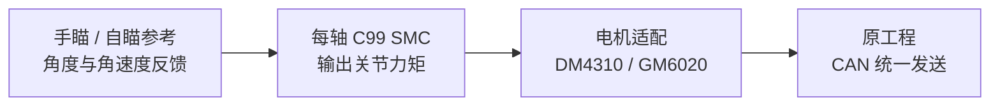
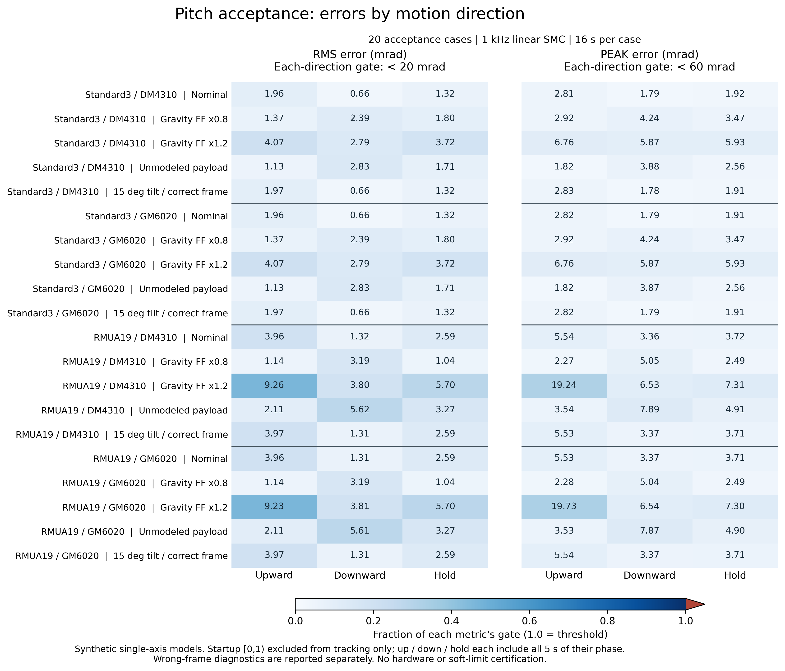

# RoboMaster SMC Controller

**可嵌入现有 RoboMaster 电控工程的 C99 云台滑模控制器。**

[](https://github.com/LYHrmer/robomaster-smc-controller/actions/workflows/c-tests.yml)
[](include/gimbal_smc.h)
[](LICENSE)

[快速开始](docs/QUICKSTART.md) · [STM32 接入](docs/STM32_PORT.md) · [Pitch 整定](docs/PITCH_TUNING.md) · [工程结构](docs/PROJECT_STRUCTURE.md) · [全部文档](docs/README.md)

本库提供每轴控制算法、DM4310 / GM6020 电机适配，以及可选的参数辨识。算法输出**关节力矩 N·m**，原工程负责遥控/自瞄目标、模式管理、INS 和 CAN 收发。各轴独立配置，优先提供 [RoboMaster 官方 C 型开发板例程](https://github.com/RoboMaster/Development-Board-C-Examples)的接入方法。

纯 C99，无 HAL、RTOS、C++ 或堆内存依赖。**当前已完成软件测试、模型仿真和 ARM 静态库编译，尚未完成实机验证。**

## 从这里开始

| 当前任务 | 阅读入口 |
|---|---|
| 第一次使用，先运行再选接口 | [快速开始](docs/QUICKSTART.md) |
| 接入现有云台，包括手瞄和自瞄 | [STM32 移植](docs/STM32_PORT.md) → [电机协议](docs/MOTOR_PROTOCOL.md) |
| 理解控制参数，处理 Pitch 重力和行程 | [控制器设计](docs/CONTROL_DESIGN.md) → [Pitch 整定](docs/PITCH_TUNING.md) |
| 从反馈数据获取模型参数 | [电脑端离线辨识](docs/IDENTIFICATION.md) / [STM32 在线拟合](docs/ONLINE_IDENTIFICATION.md) |
| 查找模块、验证依据或多轴规划 | [工程结构](docs/PROJECT_STRUCTURE.md) / [验证记录](docs/VALIDATION.md) / [多轴扩展](docs/MULTI_AXIS.md) |

## 先在电脑上运行

准备 C99 编译器、CMake 3.16+ 和构建工具。Python 3.9+ 用于模型来源检查；控制器和在线拟合本身均不依赖 Python。

```sh
git clone https://github.com/LYHrmer/robomaster-smc-controller.git
cd robomaster-smc-controller
cmake -S . -B build -DCMAKE_BUILD_TYPE=Debug
cmake --build build --parallel
ctest --test-dir build --output-on-failure
```

默认配置安装了 Python 时，应看到 **13 项测试全部通过**。测试会生成 `build/` 下的仿真数据，无需连接电机。可选的离线辨识检查需要 NumPy，开启后共 15 项；具体命令见 [快速开始](docs/QUICKSTART.md)与[构建选项](docs/PROJECT_STRUCTURE.md#构建选项)。

## 控制链路与主要功能



- **控制核心：** 默认线性滑模，可选正则化终端项；支持力矩限幅、变化率限制、速度滤波及数据有效性检查。
- **目标接入：** 只有目标角度时使用参考生成器；已有目标角度、速度、加速度时可直接调用核心。
- **Pitch 辅助：** 提供固定平面的重力模型，以及分别处理控制角、重力角和机械相对角的接入示例。

接口统一使用 **rad、rad/s、rad/s²、关节 N·m**。角速度必须是所用控制角在同一坐标下的导数。参考生成器限制速度和加速度，但不保证参考无过冲；Pitch 的参考限制也不能代替机构制动验证。完整约定见 [快速开始](docs/QUICKSTART.md)。

## 电机和轴怎么选

| 对象 | 当前接入方式 | 需要确认 |
|---|---|---|
| DM4310 | MIT 纯力矩模式，`kp=kd=0` | 协议量程、ID、传动、使能与反馈 |
| GM6020 | 原生电流模式下，将关节力矩换算为电流 | 固件/模式、力矩常数、电流限制与 CAN 分组 |
| 连续多圈 Yaw | 连续展开角；控制器与参考生成器均设 `wrap_angle=false` | 编码器圈数和目标所在圈由应用管理 |
| 有限行程 Pitch | 独立参数、重力前馈及机械角约束 | 重力相位、零位、上下行程与制动余量 |
| 三轴 / 折叠双 Pitch | 可复用单轴模块，协调层处于规划阶段 | 尚无三轴目标分配、折叠状态机或联动验证 |

**GM6020 电流组为 `0x1FE/0x2FE`，旧电压组为 `0x1FF/0x2FF`。** 旧官方 `CAN_cmd_gimbal()` 不能原样接收电流指令；本库对旧电压模式仅提供原始组帧。模式与统一发送规则见 [电机协议](docs/MOTOR_PROTOCOL.md)，折叠结构的适用边界见 [多轴扩展](docs/MULTI_AXIS.md)。

## 参数从哪里来

已有标定参数时可直接配置控制器。需要辨识惯量、阻尼、摩擦和 Pitch 重力时，可选择[离线工具](docs/IDENTIFICATION.md)分析日志，或使用[在线 RLS（递推最小二乘）](docs/ONLINE_IDENTIFICATION.md)随新数据更新估计。

两条辨识路径均要求**固定底座、固定构形，以及同步标定的关节力矩反馈**。它们输出待验证的物理参数候选，不自动选择控制增益或改写 SMC。在线 `ready` 只表示本拍满足候选数据门槛，参数由应用显式采纳。

## 已验证到哪一步

| 验证内容 | 已有结果与依据 |
|---|---|
| 主机测试 | 离线检查开启时，Debug / Release 各 15/15；默认 ASan/UBSan 13/13。见[验证记录](docs/VALIDATION.md) |
| ARM 编译 | Cortex-M4F hard-float 六个静态库通过；GitHub CI 持续检查。见[构建范围](docs/VALIDATION.md) |
| 控制闭环仿真 | [576 个开源模型组合](docs/OPEN_MODEL_VALIDATION.md)、[20 个 Pitch 验收场景](docs/PITCH_VALIDATION.md)通过；另保留 4 个错误坐标诊断 |
| 参数辨识验证 | [离线恢复与 8 个候选闭环案例](docs/IDENTIFICATION.md)；[在线 4 个候选及 4 个初值对照、12 万次 RLS 数值回归](docs/ONLINE_IDENTIFICATION.md#6-验证与适用范围)通过 |

以上是软件与模型证据，不代表实机精度、整车固件兼容性或 MCU 最坏执行时间。环境、判据、原始数据及未覆盖条件统一记录在[验证报告](docs/VALIDATION.md)。

<details>
<summary>查看 Pitch 合成仿真的分方向误差</summary>



曲线条件、门槛和原始数据见 [Pitch 专项报告](docs/PITCH_VALIDATION.md)。

</details>

## 源码入口

控制接口从 [gimbal_smc.h](include/gimbal_smc.h) 开始，接入用法见 [examples/](examples/)。电机协议见 [gimbal_motor.h](include/gimbal_motor.h)，在线云台辨识见 [gimbal_identification.h](include/gimbal_identification.h)。

[工程结构](docs/PROJECT_STRUCTURE.md)列出目录、依赖及按功能加入源文件的方法；[文档导航](docs/README.md)按接入、整定、辨识和验证组织详细说明。

## 来源、许可与反馈

参考复旦大学星云 EGA 的[滑模开源项目](https://github.com/xinruilee04/smc_controller)与[教学文章](https://bbs.robomaster.com/article/1939327?source=1)，按原理独立实现 C 接口。框架对照与完整来源见 [RM 框架接口对照](docs/RM_FRAMEWORK_INTEGRATION.md)和[参考与致谢](docs/REFERENCES.md)。

本仓库新编写的代码与说明采用 [MIT](LICENSE)；归档的第三方模型保留其 BSD-3-Clause / Apache-2.0 许可及原始声明。

提交 [Issue](https://github.com/LYHrmer/robomaster-smc-controller/issues) 时，请附电机型号/固件/模式、MCU、控制周期、轴与单位约定、参数，以及带时间戳的目标/反馈、输出力矩和故障标志。
