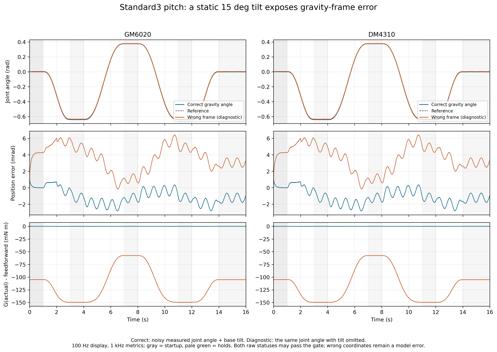

# Pitch 专项：升降、偏载与重力坐标验证

本轮增加 **20 个 pitch 验收场景和 4 个错误坐标诊断场景**，均实际执行 C 滑模核心、`gimbal_pitch_gravity_torque()` 和 DM4310／GM6020 电机字节打包。20 个验收场景全部通过；4 个诊断场景的原始指标也通过既定门槛，但错误重力坐标仍使部分方向误差明显增大。不能把这 24 个原始 `PASS` 解读为错误坐标可用、三轴适配、STM32 实机或软限位验证已经完成。

这是继[原有 576 个开源模型组合](OPEN_MODEL_VALIDATION.md)后的独立补充；旧数据和报告保留。本轮专门考察较大俯仰区间、上下行差异、重力参数偏差、附加载荷和静态底座倾斜。采用两个开源模型的 pitch 轴、两种电机、1 kHz 默认线性滑模；不重复展开整个采样率／惯量／滑模形式的组合矩阵。

## 1. 区间与轨迹

机械模型继续使用[归档原文件及派生参数](../sim/open_models/README.md)，惯量和重力符号约定不变。原测试参考为 ±0.1 rad，仅覆盖两模型 pitch 硬区间的约 14.8% 和 17.0%。本轮参考端点从源模型硬边界各向内留出 **0.08 rad**：

| 模型 | 源模型硬区间 rad | 本轮参考端点 rad | 参考覆盖硬区间比例 |
|---|---|---|---:|
| RMOSS RMUA19 | [−0.785, 0.5652] | [−0.705, 0.4852]，约 [−40.39°, 27.80°] | 88.15% |
| DynamicX Standard3 | [−0.72, 0.457] | [−0.64, 0.377]，约 [−36.67°, 21.60°] | 86.41% |

每场景 16 s，从零角度、零速度和零执行器力矩开始。以 `lo`、`hi` 表示上表两个参考端点：

| 时段 s | 参考行为 | 指标分组 |
|---|---|---|
| [0,1) | 保持 0 | 启动，单独记录 |
| [1,3) | 0 → lo | 下行 |
| [3,4) | 保持 lo | 保持 |
| [4,7) | lo → hi | 上行 |
| [7,8) | 保持 hi | 保持 |
| [8,11) | hi → lo | 下行 |
| [11,12) | 保持 lo | 保持 |
| [12,14) | lo → 0 | 上行 |
| [14,16) | 保持 0 | 保持 |

运动段采用 `q=q0+(q1−q0)(10u³−15u⁴+6u⁵)`，`u` 为该段归一化时间；速度、加速度从同一多项式解析求导，各段端点的速度和加速度均为零。上行、下行和保持各计入完整的 5 s，包含各运动段的加速、减速和换向后响应。

仅启动 `[0,1)` 预先排除于跟踪门槛之外，仍单独保存启动误差；非法状态、报文／实际力矩越限、非有限值和真实硬边界检查从起始时刻持续执行。没有按曲线好坏再挑选统计窗口。

## 2. 验收与诊断条件

前五条件均属于 `role=acceptance`，分别作用于两模型和两电机，共 20 例。第六条件属于 `role=diagnostic`，共 4 例。

| CSV 条件名 | 设置 | 角色 |
|---|---|---|
| `nominal` | 名义惯量及重力补偿 | 验收 |
| `gravity_under20` | 两个重力前馈系数均乘 0.8 | 验收 |
| `gravity_over20` | 两个重力前馈系数均乘 1.2 | 验收 |
| `payload_unmodeled` | 增加下述点质量；控制器仍用原名义惯量和重力系数 | 验收 |
| `tilted_correct` | 底座绕同一 pitch 轴静态倾斜 +15°；前馈使用正确的重力角 | 验收 |
| `tilted_wrong_frame` | 相同倾斜，前馈错误地省略底座倾角 | 诊断 |

附加载荷是**人为定义的测试条件**：质量 0.1 kg，距轴 0.08 m，方向选为在本报告符号下追加负的余弦保持力矩。实际植物模型同时增加

\[
\Delta J=mr^2=0.00064\ \mathrm{kg\,m^2},\qquad
\Delta G(q)=-mgr\cos(q)=-0.07848\cos(q)\ \mathrm{N\,m}.
\]

控制器不获知这项新增负载，因此这一例同时考察惯量和重力模型误差。不能把单独倍率缩放惯量当作这类重心变化的完整替代。

静态倾斜仅绕**同一 pitch 转轴**施加，保持力矩按 `G(q+β)` 计算，`β=15°`。正确前馈输入 `q_measured+β`，诊断输入 `q_measured`。这一区别可直接定位重力角选错的问题；它没有模拟任意三维底盘姿态、随时间变化的基座运动及其附加惯性项。

控制器的角度、速度仍采用同一关节坐标。重力辅助函数输入包含角度测量纹波，没有把无噪声植物状态直接作为理想前馈输入：

```text
角度纹波 = 0.0001 [sin(2π31t) + 0.5 sin(2π73t)] rad
速度纹波 = 0.002  [sin(2π43t) + 0.5 sin(2π91t)] rad/s
```

## 3. 共同假设与执行链

植物动力学为

\[
J\ddot q=\tau_\mathrm{actual}-0.01\dot q
-0.02\tanh(\dot q/0.02)-G(q+\beta)+d(t).
\]

新增的 `0.02 tanh(qdot/0.02) N·m` 是声明过的**合成平滑库仑近似**，并非开源模型或实机辨识得到的参数；该近似没有静摩擦滞留、启动力矩突变或回差。它有助于观察上行和下行差异，但不能代替实际摩擦辨识。

沿用 1 ms 命令延迟、3 ms 执行器一阶滞后、0.1 ms RK4 积分，以及 2 s 起的外部扰动：

\[
d(t)=-0.03+0.02\sin[2\pi\cdot1.3(t-2)]\ \mathrm{N\,m}.
\]

线性面参数固定为 `lambda=12/s,k=10/s,eta=20rad/s²,phi=0.1rad/s`；速度低通 80 Hz，力矩变化率限幅关闭，`wrap_angle=false`。没有按电机或场景单独调参，也没有加入未说明的积分补偿。

两种电机均设直连、效率 1、**±1 N·m 应用限制**。DM 使用 MIT 模式和 `PMAX=12.5,VMAX=30,TMAX=10`，GM 使用已启用的原生电流模式和 `Kt=0.741 N·m/A`。上述是测试配置，不能据此推断任意电机固件量程、实测连续额定能力或热裕量。

每个控制拍调用实际 C 核心、重力辅助函数和电机适配器，再独立从 CAN 字节解码给定力矩；没有用适配器自报的 `applied_joint_nm` 作为独立真值。指标按 1 kHz 统计，报文力矩每拍检查，植物非有限值、实际力矩及硬角度区间每 0.1 ms 子步检查。图中轨迹降采样至 100 Hz，不能用于高频抖振估计。

本轮跟踪轨迹是解析五次多项式，**没有调用 pitch 位置限位 wrapper**。控制器输出变化率、异常状态恢复和位置限位接口的独立单元测试，不应和这里的闭环机械场景混为一项验证。

## 4. 门槛、原始结果与解释

上行、下行、保持**分别**要求 RMS `<0.02 rad` 且峰值 `<0.06 rad`。任一分组超限即原始 `FAIL`；未运行的不可行场景保存 `INFEASIBLE` 和 NaN 性能字段。程序先按采样逆动力学需求检查必要力矩条件，预检通过不代表瞬态必定可行，后续仍继续闭环检查。

| 角色 | 场景数 | 原始 PASS | 原始 FAIL | INFEASIBLE |
|---|---:|---:|---:|---:|
| 验收 | 20 | 20 | 0 | 0 |
| 错误坐标诊断 | 4 | 4 | 0 | 0 |

验收中的最坏结果如下。不同指标可能来自不同场景：

| 指标 | 最坏值 | 发生条件 |
|---|---:|---|
| 上行 RMS | 0.009262987 rad，约 0.531° | RMUA19 / DM4310 / 重力前馈 ×1.2 |
| 下行 RMS | 0.005615023 rad | RMUA19 / DM4310 / 未建模附载 |
| 保持 RMS | 0.005703803 rad | RMUA19 / DM4310 / 重力前馈 ×1.2 |
| 任一方向峰值误差 | 0.019725037 rad，约 1.130° | RMUA19 / GM6020 / 重力前馈 ×1.2 / 上行 |
| 独立解码给定力矩峰值 | 0.688039124 N·m | Standard3 / GM6020 / 倾斜且正确补偿 |
| 控制器幅值饱和比例 | 0 | 全部验收场景 |
| 至真实硬边界的最小距离 | 0.073869211 rad，约 4.232° | RMUA19 / DM4310 / 重力前馈 ×1.2 |


参考端点预留的 0.08 rad **不是实测轨迹始终满足的软边界**。最小参考区间余量为 **−0.006130789 rad**：跟踪误差让实际角度越过某个参考端点约 0.351°，仍与真实硬边界相隔约 4.232°。程序没有夹住植物角度或撞限位后强行归零；本轮没有实际触碰硬边界。这支持当前轨迹在声明模型中的检查结果，不构成其它速度、载荷或限位保护策略的保证。

错误坐标诊断保留原始 `PASS/FAIL`，但不算进验收通过数。仅诊断的跟踪门槛失败不会使整体验收退出码失败；诊断中出现非有限值、非法报文、力矩或硬边界故障仍导致非零退出。不能将这个角色区分用来改写或隐藏原始失败。

本轮 4 例错误坐标虽仍低于较宽的软件回归门槛，Standard3 的下行 RMS 却较正确补偿增大 **7.19–7.21 倍**，保持 RMS 增大约 **2.79 倍**。这是应该使用正确重力坐标的直接证据，也说明仅检查“最后是否 PASS”会掩盖控制质量退化。



完整 [24 行指标](../sim/results/pitch_metrics.csv)保留每个场景的参数、角色、状态、分方向 RMS／峰值／有符号偏差、力矩及边界余量；[机器可读汇总](../sim/results/pitch/summary.json)保留最坏值对应场景和输入 SHA256。

## 5. 负路径与复现

单独的 `--self-test` 从同一来源 CSV 读取 `dynamicx_standard3/pitch`，将应用限制改为 ±0.25 N·m。所选参考的采样逆动力学需求峰值为 **0.516445361 N·m**；量化后的对称可用值为 GM6020 **0.249924683 N·m**、DM4310 **0.246642247 N·m**。两者必须被识别为 `INFEASIBLE`，自测试才返回零。它们是两个负路径检查，**不计入上述 24 个闭环场景**。

另外执行过空表、NaN、无 pitch 轴、非法参考区间和超大重力输入，均返回非零；没有把未运行场景当作通过。

```sh
cmake -S . -B build-release -DCMAKE_BUILD_TYPE=Release
cmake --build build-release --parallel
build-release/validate_pitch sim/open_models/profiles.csv \
  build-release/pitch_metrics.csv build-release/pitch_trace.csv
build-release/validate_pitch --self-test sim/open_models/profiles.csv
python3 sim/plot_pitch.py \
  build-release/pitch_metrics.csv build-release/pitch_trace.csv sim/results/pitch
```

绘图需要 Matplotlib（及其 NumPy 依赖），使用 Agg 后端，无需 GUI；若用户 Python 包与系统依赖混杂，可用 `/usr/bin/python3 -s` 在装有系统 Matplotlib 的环境运行。每张图同时生成 300 dpi PNG、SVG、PDF。绘图只汇总已有状态，不替代 C 验证程序的退出码。

轨迹 CSV 包含 38,400 个显示采样，复现后保存在 `build-release/pitch_trace.csv`；逐场景指标归档至 `sim/results/pitch_metrics.csv`。固定输入与编译环境下可按同一命令重新生成图表。

## 6. 部署含义

这组结果补充了 pitch 大区间升降、重力高估／低估、偏载和静态倾角的模型证据，表明同一可移植 C 控制核心在这些具体条件下完成了既定跟踪门槛。它没有覆盖完整 yaw/pitch 耦合、第三轴、运动底盘惯性、摩擦轮陀螺效应、柔性、齿隙、FOC、电压饱和、温升或真实通信故障，也尚无 STM32 执行时序和实机精度数据。

实际 pitch 参数仍应单独辨识和整定：先统一反馈与力矩正方向、重力角基准和实际限位，再估计保持力矩、惯量及摩擦。仿真默认增益和上述角度误差不是任意云台的通用实机参数或精度承诺。
