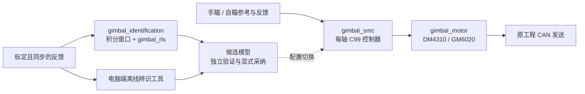

# 工程结构与构建选择

[项目首页](../README.md) · [文档导航](README.md)

工程按“控制、物理量适配、参数获取、验证”分工。现有源码路径保持稳定，按需要加入模块即可。

## 源码模块

| CMake目标 | 接口与实现 | 依赖 / 职责 |
|---|---|---|
| `gimbal_smc` | [头文件](../include/gimbal_smc.h) / [C实现](../src/gimbal_smc.c) | 数学库；单轴滑模与参考生成 |
| `gimbal_motor` | [头文件](../include/gimbal_motor.h) / [C实现](../src/gimbal_motor.c) | 数学库；力矩转换及协议，不发送CAN |
| `gimbal_pitch` | [头文件](../include/gimbal_pitch.h) / [C实现](../src/gimbal_pitch.c) | 数学库；固定平面有符号重力 |
| `gimbal_rls` | [头文件](../include/gimbal_rls.h) / [C实现](../src/gimbal_rls.c) | 数学库；最多5参数的在线回归 |
| `gimbal_identification` | [头文件](../include/gimbal_identification.h) / [C实现](../src/gimbal_identification.c) | `gimbal_rls`；时间戳、数据有效性与积分转换 |
| `gimbal_example` | [通用轴](../examples/gimbal_controller_example.c) / [Pitch](../examples/gimbal_pitch_example.c) | 控制、电机和Pitch模块；位置目标接入 |

STM32工程可以直接加入所需`.c`及`include/`路径，不要求使用CMake。只接滑模控制时无需增加在线辨识状态。

## 目录与阅读入口

| 目录 | 内容 | 入口 |
|---|---|---|
| `include/`、`src/` | 可移植C99库 | 头文件说明单位、调用约束和返回状态 |
| `examples/` | 通用轴和Pitch接入 | [STM32移植](STM32_PORT.md) |
| `tools/` | 电脑端模型来源复算、离线辨识与验证脚本 | [离线辨识](IDENTIFICATION.md) |
| `tests/` | C回归与可选Python辨识检查 | CMake/CTest |
| `sim/` | 实际调用C库的合成验证 | [验证总览](VALIDATION.md) |
| `sim/open_models/` | 固定版本第三方模型、许可与派生参数 | [模型归档说明](../sim/open_models/README.md) |
| `sim/results/` | 已归档指标和图件 | 各验证报告说明数据口径 |
| `docs/` | 入门、设计、协议、整定、辨识与验证 | [导航](README.md) |

## 构建选项

| 选项 | 默认 | 用途 |
|---|---|---|
| `GIMBAL_BUILD_TESTS` | ON | 主机C回归 |
| `GIMBAL_BUILD_EXAMPLES` | ON | 编译通用轴/Pitch接入库 |
| `GIMBAL_BUILD_SIM` | ON | 合成验证程序，包括在线辨识闭环 |
| `GIMBAL_SANITIZE` | OFF | 主机AddressSanitizer/UBSan |
| `GIMBAL_BUILD_IDENTIFICATION` | OFF | 额外的电脑端离线辨识检查，需要Python/NumPy |

在线RLS与云台转换层都是C模块，常规主机构建即包含，无需开启最后一项。最后一项仅控制电脑端工具测试，不能用它开启或关闭电机上的在线拟合。

ARM交叉编译关闭主机测试和仿真；示例库可按需保留。工具链参数必须与整个固件一致，具体命令见[构建验证](VALIDATION.md)。

## 推荐接入顺序

1. [快速开始](QUICKSTART.md)：运行默认主机回归，确定单位与目标接口。
2. [STM32移植](STM32_PORT.md)与[电机协议](MOTOR_PROTOCOL.md)：接入已有模式、反馈和CAN发送。
3. [Pitch整定](PITCH_TUNING.md)：确定三个角度、支撑力矩和行程。
4. [离线辨识](IDENTIFICATION.md)：从标定日志得到物理模型初值。
5. [在线拟合](ONLINE_IDENTIFICATION.md)：记录参数变化与数据质量，验证后显式应用。

折叠双Pitch、大小Yaw的机构协调仍按[多轴扩展规划](MULTI_AXIS.md)推进；每轴可独立保存模型，不代表三轴耦合已经完成。
